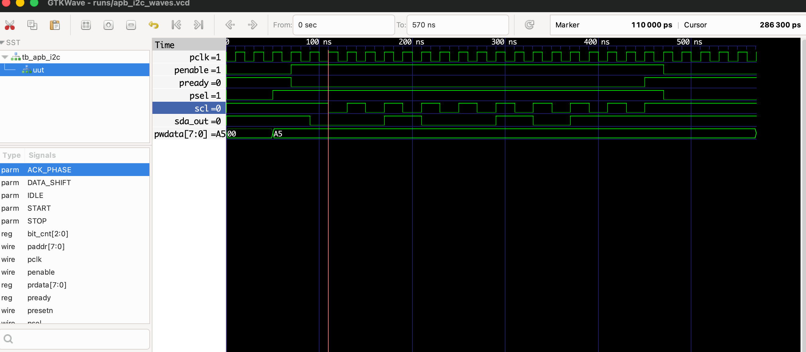

# AMBA APB to I2C Protocol Bridge

## Overview
A synthesizable Register Transfer Level (RTL) implementation of a protocol bridge translating high-speed AMBA APB bus transactions to standard I2C serial communication. This IP block is designed to integrate low-speed peripherals into a high-performance System-on-Chip (SoC) environment, specifically capable of interfacing with a custom 32-bit RISC-V (RV32I) CPU core.

## Technical Specifications
* **Hardware Description Language:** Verilog (IEEE 1364-2005)
* **Simulation & Verification:** Icarus Verilog
* **Waveform Analysis:** GTKWave
* **Automation:** Bash Shell Scripting

## Directory Structure
```text
apb_i2c_bridge/
├── src/                 # Synthesizable RTL source files
│   └── apb_i2c_bridge.v
├── tb/                  # Verification environment and testbenches
│   └── tb_apb_i2c.v
├── runs/                # Simulation outputs and VCD waveform files
├── docs/                # Project documentation and diagrams
├── sim.sh               # Automated compilation and simulation script
└── README.md
```
## Microarchitecture: FSM Design

The core control logic of the APB-to-I2C bridge is driven by a 5-state Finite State Machine (FSM). The FSM handles clock domain pacing and protocol translation, ensuring that high-speed parallel APB transactions are safely serialized into the I2C protocol.

### FSM State Definitions & Logic

| State | Description | Outputs & Bus Control | Next State Condition |
| :--- | :--- | :--- | :--- |
| **`IDLE`** | Default state. Bridge is passive. | `pready = 1` (Bus free). `SCL = 1`, `SDA = 1`. | Transitions to `START` when APB asserts `psel` && `penable`. |
| **`START`** | Generates the I2C Start Condition. | `pready = 0` (Stalls APB). Pulls `SDA` Low while `SCL` is High. | Unconditional transition to `DATA_SHIFT` on the next I2C clock tick. |
| **`DATA_SHIFT`** | Serializes the 8-bit APB `pwdata`. | `pready = 0`. Toggles `SCL`. Shifts data onto `SDA` on SCL Low. | Transitions to `ACK_PHASE` when 8-bit counter reaches 0. |
| **`ACK_PHASE`** | Listens for Slave Acknowledgment. | `pready = 0`. Releases `SDA` (High-Z) to allow Slave to pull low. | Unconditional transition to `STOP` (for single-byte transfers). |
| **`STOP`** | Generates the I2C Stop Condition. | `pready = 1` (Unstalls APB). Pulls `SDA` High while `SCL` is High. | Unconditional transition to `IDLE`. |

### Design Considerations for Silicon
* **Wait-State Insertion:** The `pready` signal is dynamically controlled by the FSM. It is immediately de-asserted upon leaving `IDLE` to prevent the RISC-V core from overwriting the APB data registers while the slow I2C transmission is in progress.
* **Glitch-Free Outputs:** State transitions are strictly synchronized to the system `pclk`, but I2C wire toggling is guarded by a clock-divider enable tick to ensure setup/hold times for the I2C specification are met.

### Simulation Results

*Waveform demonstrating successful wait-state insertion (`pready` logic) during the parallel-to-serial protocol translation of payload 0xA5.*

The sda_out is only read when scl is high so the result is correctly `A0(10100101)`
## Verification Strategy and Simulation Results
A self-checking testbench was developed to verify dynamic wait-state insertion during the parallel-to-serial conversion of a simulated processor payload (0xA5).

Waveform Image : Waveform demonstrating successful wait-state insertion. The APB bus is stalled (pready = 0) while the I2C FSM accurately serializes the 10100101 payload, followed by a clean bus release.


## Quickstart : How to run

A bash script for running is included. It also works on latest mac version of GTKwave which must be built from source.
The script compiles the RTL, runs the testbench and launches GTKWave natively on macOS.

```bash
# this makes the script executable rather than plain text
chmod +x sim.sh

./sim.sh

```


